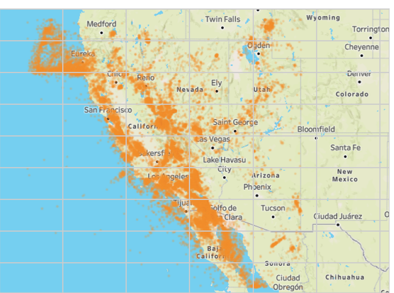
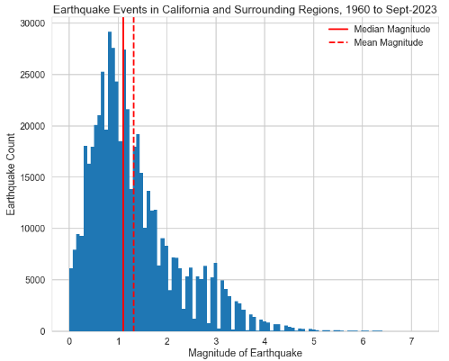
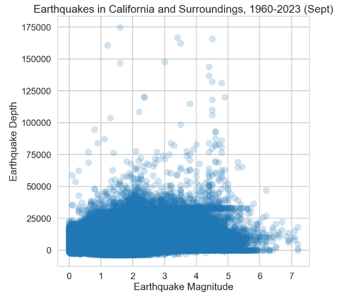
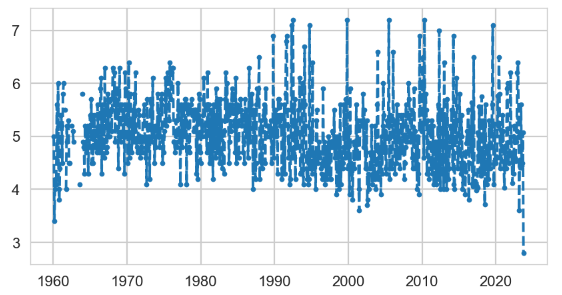
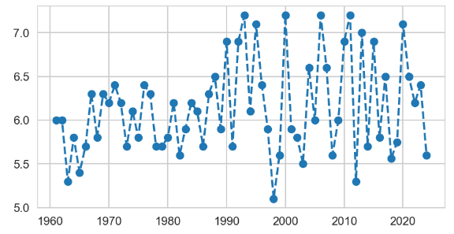
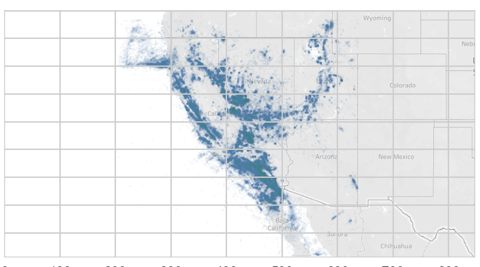
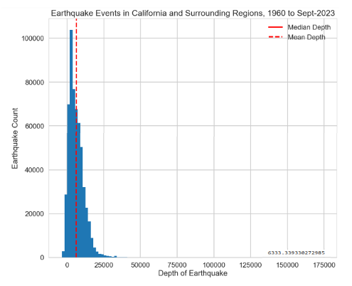

# 63-Years-of-Seismicity-in-California
A data driven exploration of earthquakes in California and surrounding regions from 1960 to 2023 (September) with data from the IRIS network.

The state of California is one of the most seismically active regions in the United States, owing much to its location along the Pacific Ring of Fire. The region is intersected by several major fault lines, including the San Andreas Fault, the Hayward Fault, and the San Jacinto Fault, among others. These fault systems are a part of the larger boundary between the Pacific Plate and the North American Plate.

Seismicity in California is characterized by frequent low to moderate magnitude earthquakes and the occasional significant seismic event. The interaction between the plates not only results in earthquakes but also has given rise to various topographical features, including mountain ranges and basins.

Historically, California has experienced several devastating earthquakes, including the 1906 San Francisco earthquake, the 1989 Loma Prieta earthquake, and the 1994 Northridge earthquake. These events caused considerable damage and loss of life, highlighting the seismic risk in the region.

A visualization of the maximum magntidue earthquake in the California region by month since 1960.

A visualization of the maximum magntidue earthquake in the California region by year since 1960.

To make the state a safer place to live, California has implemented stringent building codes and has invested in early warning systems and public education on earthquake preparedness. Seismic research in the state is at the forefront, with many institutions and organizations continuously monitoring seismic activity and working towards improving the understanding and prediction of earthquakes in the region. The California Institute of Technology is one institution at the forefront of earthquake research in the region.

The study of seismicity in California has a bright future, leading to a future predictive science that might one day accurately foresee the impact of future seismic events, enabling a culture of true predictive preparedness and resilience in the face of an ever present Californian seismicity.

In this data driven study we use data from the IRIS network to characterize the past 63 years of seismicity in California, using the full temporal range available in the IRIS network as accessed through the ObsPy Python library. 

The IRIS (Incorporated Research Institutions for Seismology) database is a comprehensive resource for earthquake data and related seismological information. It is maintained by a consortium of research institutions and provides a vast collection of seismic data, which can be accessed through various methods, including the ObsPy Python library (https://pypi.org/project/obspy/).

The code to produce all these visualizations of seismicity in California can be found in the Jupyter notebook in this repo. Enjoy!

It is interesting to note a few things. First, Major Californian earthquakes are not overly deep. Secondly, large earthquakes (i.e., over 7.0) picked up in the region starting around 1990. Topics for future studies!

## Miscellaneous Facts

10 San Andreas Fault Facts:
Source: https://www.geologyin.com/2016/02/did-you-know-10-facts-about-san-andreas.html

*The San Andreas Fault is a continental transform fault that extends roughly 1300 km (810 miles) through California.

*It forms the tectonic boundary between the Pacific Plate and the North American Plate, and its motion is right-lateral strike-slip (horizontal).

*The fault divides into three segments, each with different characteristics and a different degree of earthquake risk, the most significant being the southern segment, which passes within about 35 miles of Los Angeles.

*The fault was first identified in 1895 by professor Andrew Lawson from UC Berkeley who discovered the northern zone. It is named after San Andreas Lake, a small body of water that was formed in a valley between the two plates. Following the 1906 San Francisco earthquake, Lawson concluded that the fault extended all the way into southern California.

*The Pacific Plate, to the west of the fault, is moving in a northwest direction while the North American Plate to the east is moving toward the southwest, but relatively southeast under the influence of plate tectonics. The rate of slippage averages about 33 to 37 millimeters (1.3 to 1.5 in) a year across California.

*Assuming the plate boundary does not change as hypothesized, projected motion indicates that the landmass west of the San Andreas Fault, including Los Angeles, will eventually slide past San Francisco, then continue northwestward toward the Aleutian Trench, over a period of perhaps twenty million years

*The San Andreas began to form in the mid Cenozoic about 30 Mya (million years ago), while The main southern section of the San Andreas Fault proper has only existed for about 5 million years.

*(The Mormon Rocks within Cajon Pass show the physical movement of the San Andreas fault in southern California.)

*The Southern segment of the Fault, which stretches from Parkfield in Monterey County all the way down to the Salton Sea, is capable of an 8.1 magnitude earthquake. At its closest, this fault passes about 35 miles to the northeast of Los Angeles. Such a large earthquake on this Southern segment would kill thousands of people in Los Angeles, San Bernandino, Riverside, and surrounding areas, and cause hundreds of billions of dollars in damage.

*(History of the San Andreas Fault, Gaspar de Portola, Andrew Lawson, Alfred Wegener and Harry Hess)

*Currently, it is believed that the modern San Andreas will eventually transfer its motion toward a fault within the Eastern California Shear Zone. 

*A project called the San Andreas Fault Observatory at Depth (SAFOD) near Parkfield, Monterey County, is drilling into the fault to improve prediction and recording of future earthquakes.

*(Vasquez Rocks in Agua Dulce, California are evidence of the San Andreas Fault line and part of the 2,650 mile Pacific Crest Trail.)

## Miscellaneous Facts 2

*200 Million Years Ago: Heavy Pacific Plate Collides with North American Plate. Pacific Plate starts to sink 
beneath the lighter continent. Subduction.   

*Many millions of years prior to the creation of the San Andreas fault, the Pacific Plate is subducting 
	below North America. Oceanic plate diving down. Process goes on for over 100 Million Years.   

*20 Million Years Ago, the Plate motions are such, that, the Pacific Plate is forced to start sliding North
with respect to North America. Now, the principle motion is this sliding motion between the 2 plates. 

*20 Million Years Ago the San Andreas Fault was born. 

*800 Miles Long San Andreas Fault. Emerges from seabed at Petrolia (or Cape Mendocino) in Northern California and extending
	to the Salton Sea in Southern California. 

--

**Neenach Volcano**:

*The volcano formed 23 million years ago [2] during tectonic subduction of the oceanic Juan de Fuca Plate beneath the continental North American Plate, a process often associated with volcanic eruptions near the plate boundaries. Subsequent complex geophysical mechanisms caused a segment of the Juan de Fuca Plate to fuse to the eastern edge of the adjoining Pacific Plate, ending subduction and initiating horizontal shear movement between the plates, with the Pacific Plate moving northwesterly and the North American Plate moving in the opposite southeast direction.[3] This transform movement began approximately 20 million years ago and the resultant shear lineation is the San Andreas Fault Zone.[4] The Neenach Volcano was situated directly over the primary San Andreas fault, causing it to be split in two once the transform fault movement began.[5] The average relative motion along the fault is about 1.5 cm per year, equivalent to six inches per decade. Over the course of this movement, the two halves of the volcano drifted about 195 miles (314 kilometers) apart and eroded down into the minor rock formations visible today.

*The remnants of the eastern portion of the volcano, called the Neenach Formation, lie about 195 miles (314 kilometers) south of the western portion near Neenach, California. (34°44′58.30″N 118°35′51.62″W).[6] The formation covers about 10 square miles and is notable for the distinct and strongly linear boundary along its southerly side, where the San Andreas Fault split the original volcano. This entire southern boundary is accessible by Pine Canyon Road (Los Angeles County Route N2) between Sandberg and Three Points. Surface rock exposures in the formation appear to consist primarily of dacite and andesite flows, which have weathered into nondescript low hills with few outcrops, unlike the dramatic megaliths in the northern portion.[8]

## Deep History of San Andreas-type Faults in California

*20 Million Years Ago, Earliest San Andreas type fault, 3 found segemnts of the early fault (palinspastic reconstruction):
	1. **San Francisquito Fault**, runs through western end of the San Gabriel Mountains
	2. **Fenner Fault**, also in San Gabriel Mountains, lies a few miles east of Valyermo
	3. **Clemens Well Fault**, lies far to the east in the Orocopia Mountains near the Salton Sea

20MYA to 12MYA: **San Fracisquito-Fenner-Clemens Wells Fault** was a single long strand and primary transform  fault in California. **60 Miles of horizontal displacement** accumulated along it. 

12 MYA, Southern Fault becomes **San Gabriel Fault**, runs along the western and southern boundaries of the San Gabriel Mountain.s 

After several million years, seismic activity shifted again in northern and southern California (modern **San Andreas Fault**)

## Future of San Andreas Fault

See: Dvorak, John. Earthquake Storms. Simon and Schuster, 2014.

Gulf of California motion, consequence is San Andreas Fault shifting fault motion to the East. Walker Lane Seismic Zone (passes through Reno, NV, and Lake Tahoe . . . ), then Intermountain Seismic Belt (through middle of Utah, east of the Great Salt Lake)

